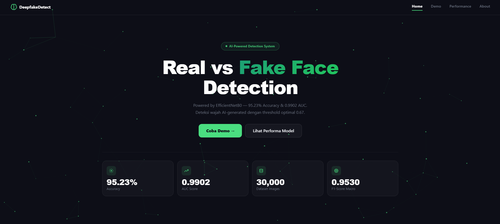
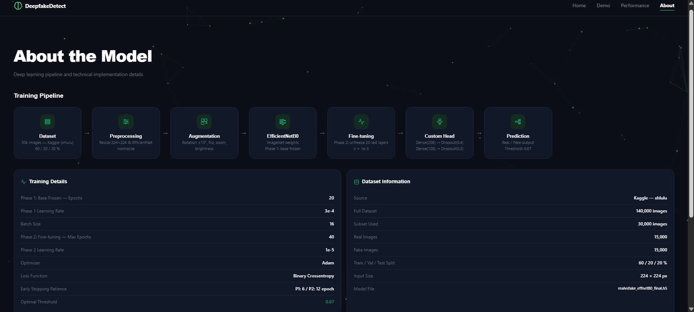
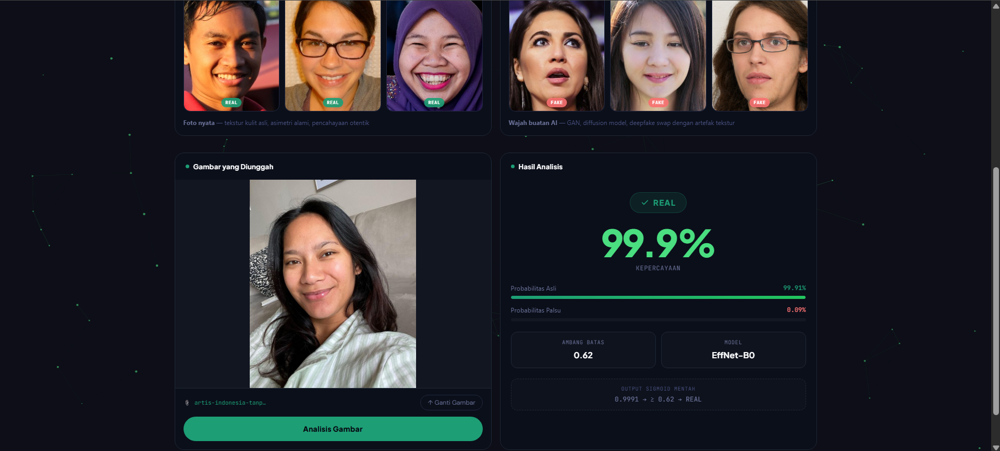
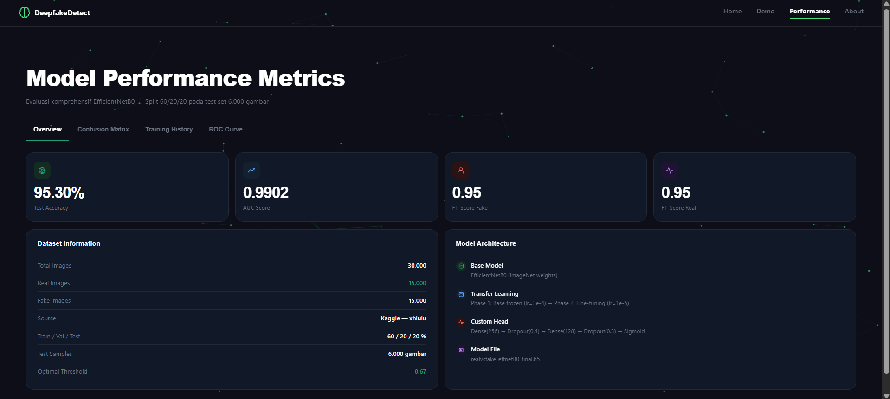
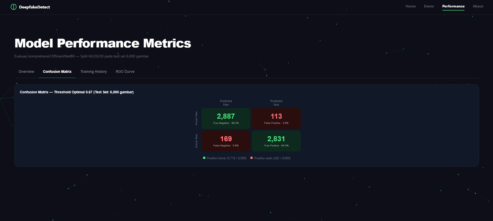
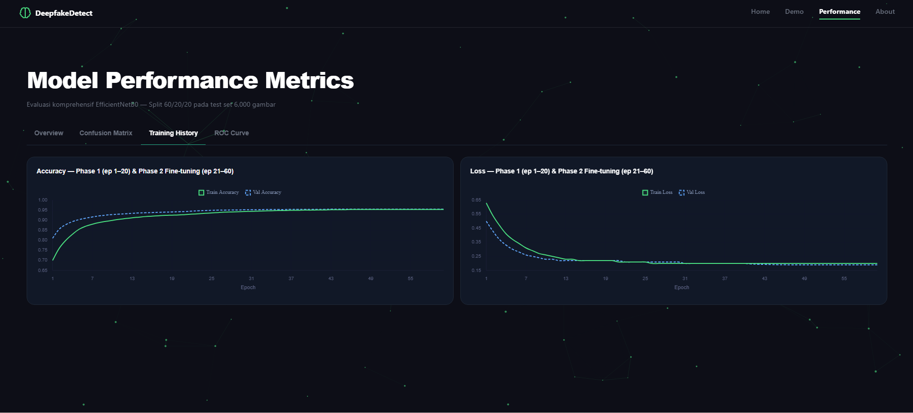
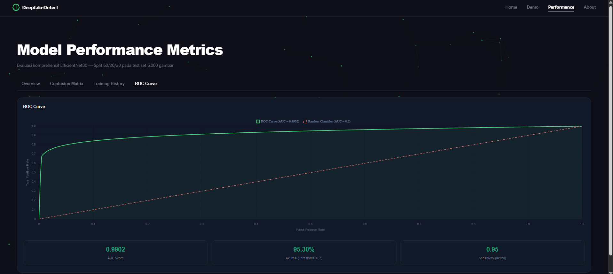

## 🚀 Cara Instalasi & Menjalankan

1. **Clone repository ini**
```bash
   git clone https://github.com/ermilaamanda102/real-fake-web-detection.git
   cd real-fake-web-detection
```

2. **Buat virtual environment**
```bash
   python -m venv venv
```

3. **Aktifkan virtual environment**

   Windows (PowerShell):
```bash
   venv\Scripts\Activate.ps1
```

   Mac/Linux:
```bash
   source venv/bin/activate
```

4. **Install dependencies**
```bash
   pip install -r requirements.txt
```

5. **Jalankan aplikasi**
```bash
   python app.py
```

6. Buka browser dan akses `http://127.0.0.1:5000`

## 🖼️ Tampilan Aplikasi

### Halaman Home


### Halaman About


### Halaman Demo / Deteksi



### Halaman Performance / Hasil Evaluasi Model


## 📊 Performa Model

- Akurasi: **95.30%**
- AUC: **0.9902**
- F1-Score: **0.9530**
- Threshold klasifikasi: **0.62**

### Visualisasi Hasil Evaluasi





## 👤 Author

Dibuat oleh **Ermila Amanda** sebagai bagian dari tugas akhir/skripsi.

## 📄 Lisensi

Project ini dibuat untuk keperluan akademik.